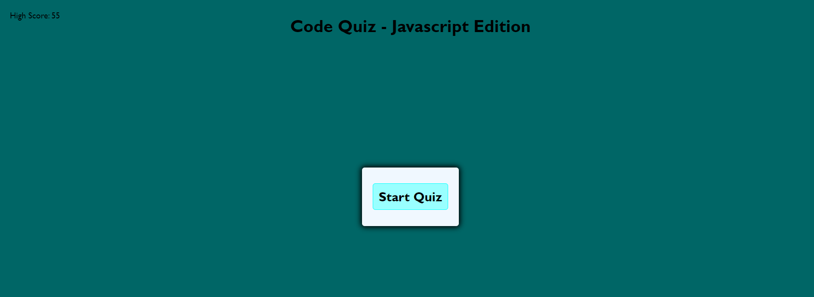
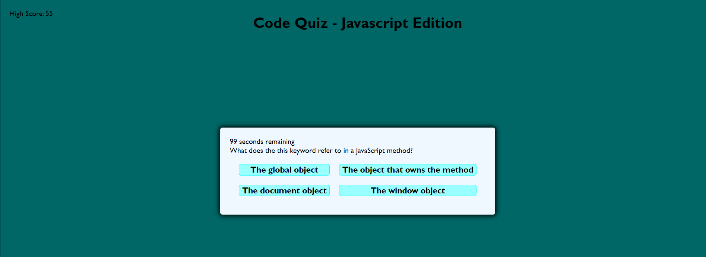
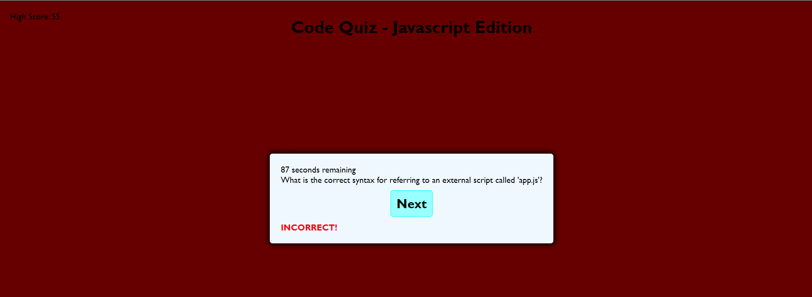
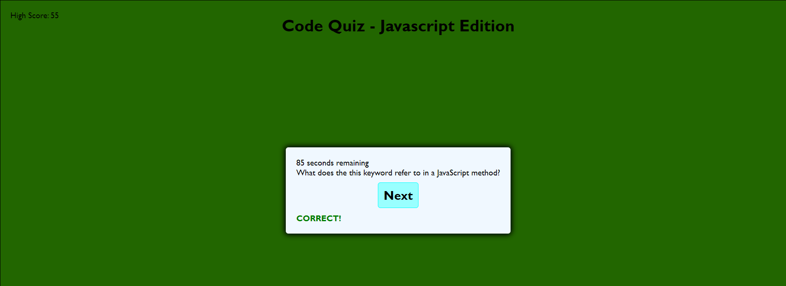
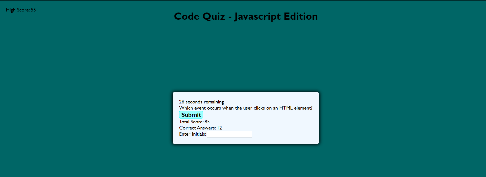

# w4c-code-quiz

Code Quiz - Javascript Edition

## Description
This is a quiz application for coding which involves Javascript questions. The quiz is timed and scores are saved.

## Installation

Browser with local storage is required.

Application can be found here:
https://jinkc21.github.io/w4c-code-quiz/

## Usage

When the quiz is started using the start button, a timer initiates while questions and answers are revealed.

If an incorrect answer is selected, time is subtracted from the timer. 

If a correct answer is selected, points are added to the score. 

The quiz ends when the time runs out or all questions are answered. When the quiz is over, users can enter their initials and submit their score. The score and initials are stored in local storage and high scores are displayed.

## Credits

Quiz template and tutorial was provided by Web Dev Simplified on YouTube:
https://www.youtube.com/watch?v=riDzcEQbX6k

MDM Web Docs helped provide information to create the timer function and store data:
https://developer.mozilla.org/en-US/docs/Web/API/setInterval
https://developer.mozilla.org/en-US/docs/Web/API/clearInterval
https://developer.mozilla.org/en-US/docs/Web/API/Web_Storage_API/Using_the_Web_Storage_API

Quiz questions were provided by Laurence Svekis on LinkedIn:
https://www.linkedin.com/pulse/ultimate-javascript-quiz-over-200-questions-test-your-svekis--eilzc/

## License

MIT License

Copyright (c) 2024 jinkc21

Permission is hereby granted, free of charge, to any person obtaining a copy
of this software and associated documentation files (the "Software"), to deal
in the Software without restriction, including without limitation the rights
to use, copy, modify, merge, publish, distribute, sublicense, and/or sell
copies of the Software, and to permit persons to whom the Software is
furnished to do so, subject to the following conditions:

The above copyright notice and this permission notice shall be included in all
copies or substantial portions of the Software.

THE SOFTWARE IS PROVIDED "AS IS", WITHOUT WARRANTY OF ANY KIND, EXPRESS OR
IMPLIED, INCLUDING BUT NOT LIMITED TO THE WARRANTIES OF MERCHANTABILITY,
FITNESS FOR A PARTICULAR PURPOSE AND NONINFRINGEMENT. IN NO EVENT SHALL THE
AUTHORS OR COPYRIGHT HOLDERS BE LIABLE FOR ANY CLAIM, DAMAGES OR OTHER
LIABILITY, WHETHER IN AN ACTION OF CONTRACT, TORT OR OTHERWISE, ARISING FROM,
OUT OF OR IN CONNECTION WITH THE SOFTWARE OR THE USE OR OTHER DEALINGS IN THE
SOFTWARE.
---